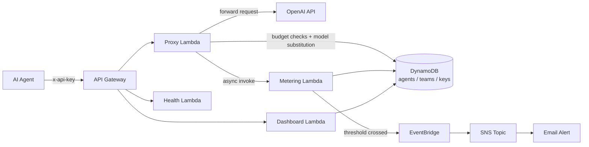

# BudgetGuard AI

A serverless cost-governance layer that sits in front of the OpenAI API so autonomous AI agents can't run up runaway bills. Agents call *your* API instead of OpenAI directly — every request is checked against per-agent, per-session, and per-team budgets before it's allowed through, with automatic model downgrades, hard cutoffs, and a runaway-spend circuit breaker.

Built entirely on AWS with the CDK (Python), deployed as real infrastructure — not a local mock.

## Live Demo

The stack is deployed and running on AWS right now:

- **Dashboard:** https://834dz6r99f.execute-api.us-east-1.amazonaws.com/v1/dashboard
- **Health check:** https://834dz6r99f.execute-api.us-east-1.amazonaws.com/v1/health

Both are read-only and require no API key. `POST /chat/completions` does require a budget-scoped API key (issued via `register.py`), which is intentionally not published here.

## Why

LLM-calling agents can loop, retry, or misbehave in ways that burn through API budgets in minutes. This project puts a policy-enforcement proxy between agents and the LLM provider, so spend limits are enforced server-side, not left to the agent's own good behavior.

## Architecture



## Features

- **Budget enforcement at three levels** — per session, per agent (monthly), and per team (monthly).
- **Warning + hard-block thresholds** — an 80% warning flag on every response, a hard `429` block at 100%.
- **Per-model sub-budgets with automatic substitution** — e.g. an agent that exhausts its `gpt-4o` allowance can be silently downgraded to a cheaper model instead of failing outright.
- **Runaway-spend circuit breaker** — if an agent burns ≥20% of its monthly limit in a single hour, it's automatically paused (`status: PAUSED`) pending human review.
- **Real-time email alerts** — `budget.warning`, `budget.exhausted`, and `budget.runaway` events fan out through EventBridge → SNS → email.
- **Live dashboard** — org-wide and per-team spend trends, per-agent status badges, per-model breakdowns, and per-session drill-down, auto-refreshing every 10s.
- **Concurrency-safe metering** — spend counters use atomic DynamoDB `ADD` update expressions, so concurrent calls from the same agent never lose an update.

## How it works

1. A request hits `POST /chat/completions` with an `x-api-key` header identifying the calling agent.
2. The **proxy Lambda** looks up the agent/team's current spend and limits in DynamoDB. If the agent is paused or any budget is already exhausted, the request is rejected (`402` / `403` / `429`) before it ever reaches OpenAI.
3. If the requested model has hit its own sub-limit and a substitution is configured, the model is swapped transparently.
4. The (possibly substituted) request is forwarded to the real OpenAI API.
5. Once a response comes back, the proxy estimates cost from token usage and asynchronously invokes the **metering Lambda** — the agent isn't kept waiting on bookkeeping.
6. The metering Lambda atomically updates spend counters, checks thresholds, fires alert events, and applies the runaway pause if needed.
7. The response returned to the agent includes a `_governance` block: whether a warning threshold was crossed, whether the model was substituted, and the estimated cost of the call.

## API

| Method | Path                  | Purpose                                      |
|--------|-----------------------|-----------------------------------------------|
| `POST` | `/chat/completions`   | Budget-checked proxy to OpenAI's chat completions |
| `GET`  | `/health`              | Health check (verifies DynamoDB connectivity) |
| `GET`  | `/dashboard`           | Live HTML spend dashboard                     |
| `GET`  | `/dashboard/data`      | JSON data backing the dashboard                |

## Repo layout

```
budget_controller/          CDK stack definition (DynamoDB, Lambdas, API Gateway, EventBridge, SNS)
lambda/proxy/                Budget-checked OpenAI proxy
lambda/metering/              Atomic spend tracking, threshold + runaway detection
lambda/health/                 Health check endpoint
lambda/dashboard/               Live dashboard (HTML + JSON API)
register.py                  Local script to register a team/agent and issue an API key
test_success_criteria.py      End-to-end test script against a deployed stack
tests/unit/                  CDK unit tests
```

## Deploying it yourself

Requires: Node.js, Python 3.12, the AWS CDK CLI, and AWS credentials configured (`aws configure`).

```bash
python -m venv .venv
.venv\Scripts\activate        # Windows
pip install -r requirements.txt

cdk bootstrap aws://<account-id>/<region>   # one-time per account/region
cdk deploy -c openai_api_key="sk-...your OpenAI key..."
```

The deploy prints out the API base URL and dashboard URL as CloudFormation outputs.

### Registering an agent

```bash
python register.py
```

This creates a demo team and agent with configurable monthly/session/per-model limits and prints a fresh API key to use against the proxy.

### Running the test suite

```bash
export API_URL="https://<your-api-id>.execute-api.<region>.amazonaws.com/v1"
export API_KEY="sk-budget-..."
python test_success_criteria.py
```

Exercises concurrent-call tracking, the 80%/100% budget thresholds, session budget limits, model substitution, and the runaway detector.

## Tech stack

AWS CDK (Python) · Lambda (Python 3.12) · DynamoDB · API Gateway · EventBridge · SNS · OpenAI API

## Known limitations

- Spend periods don't roll over automatically (`PERIOD#current` is a single running record, not reset monthly) — a deliberate MVP simplification.
- No API key revocation flow yet — issuing a new key doesn't invalidate previously issued ones for the same agent.
- Pricing table in the proxy Lambda is a static, illustrative `$/1k tokens` map and needs updating as OpenAI's pricing changes.
